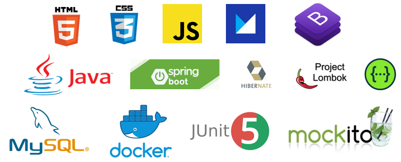
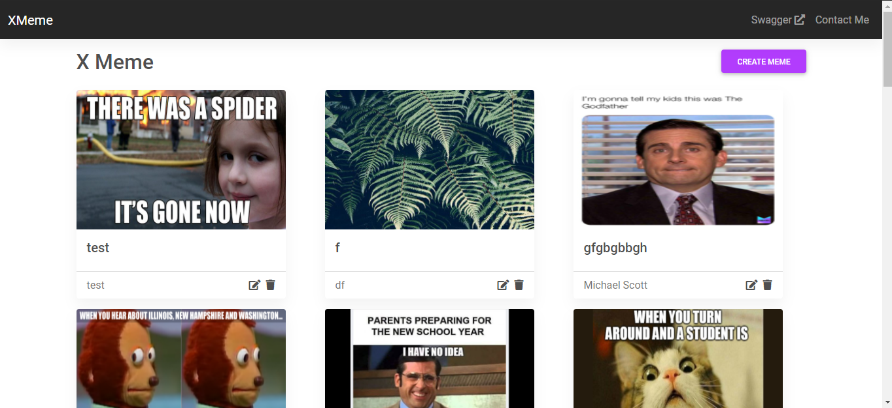
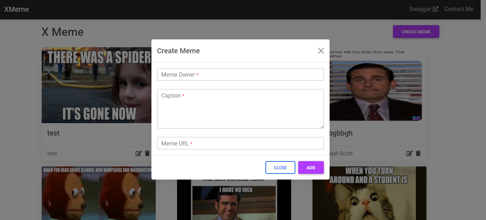
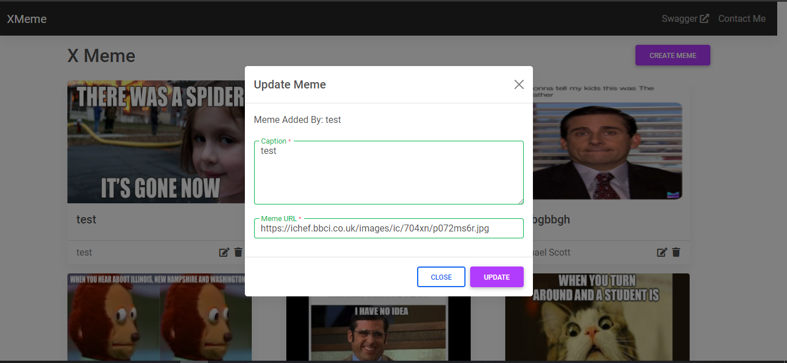
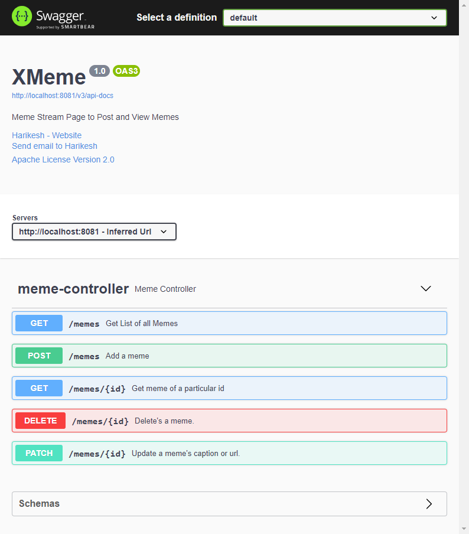

# XMeme
[](https://app.netlify.com/sites/harikesh-xmeme/deploys)


Meme Stream Page where users can post memes by providing their name, a caption for the meme and the URL for the meme image as input.
## Technology Stack
[](techstack.png "Tech Stack")
### Front End
- HTML
- CSS
- Vannila Javascript
- Bootstrap 5
- Material UI
### Back End
- MySQL
- Java 8
- Spring Boot v2.4.2
- Hibernate
- Swagger
- Lombok
- Mockito
- JUnit 5
## Prerequisites
- [Java](https://www.java.com/en/download/ "Java 8+")
- [Maven](http://https://maven.apache.org/download.cgi "Maven")
- [VS Code](https://code.visualstudio.com/download "VS Code") or any Preffered IDE
- [Eclipse](https://www.eclipse.org/downloads/ "Eclipse") or any other Java supported IDE
- [MySQL](https://www.mysql.com/downloads/ "MySQL") Database
## Running Backend
1.  First clone the repository using the following command:
```bash
git clone https://github.com/harikesh409/xmeme.git
```
2. Change the current directory to the backend directory of the clone repo.
```bash
cd xmeme/backend/XMeme/
```
3. Run the backend server using maven.
```mvnw spring-boot:run```
4.  Running using docker-compose.
```docker-compose up -d```
5. By default the application will run on port 8081.

### Endpoints
1. Get all Memes - GET Method <br>
The pagenumber and pagesize parameters are optional.<br>
[http://localhost:8081/memes?pageNumber=0&pageSize=100](http://localhost:8081/memes?pageNumber=0&pageSize=100 "http://localhost:8081/memes?pageNumber=0&pageSize=100")
<br>CURL example:
```bash
curl --location --request GET 'http://localhost:8081/memes'
```
2. Get Meme by ID - GET Method <br>
Pass the meme id in the url.<br>
[http://localhost:8081/memes/id](http://localhost:8081/memes/id "http://localhost:8081/memes/id")
<br>CURL example:
```bash
curl --location --request GET 'http://localhost:8081/memes/1'
```
3. Add Meme - POST Method<br>
Pass name, url, and caption on request body as json.<br>
[http://localhost:8081/memes](http://localhost:8081/memes "http://localhost:8081/memes")
<br>CURL example:
```bash
curl --location --request POST 'http://localhost:8081/memes' \
--header 'Content-Type: application/json' \
--data-raw '{
"name": "xyz",
"url": "https://ichef.bbci.co.uk/images/ic/704xn/p072ms6r.jpg",
"caption": "This is a meme"
}'
```
4. Update a Meme by ID - PATCH Method<br>
Pass meme id in the url and caption, url in request body as json.<br>
[http://localhost:8081/memes/id](http://localhost:8081/memes/id "http://localhost:8081/memes/id")
<br>CURL example:
```bash
curl --location --request PATCH 'http://localhost:8081/memes/1' \
--header 'Content-Type: application/json' \
--data-raw '{
	"caption":"updated caption",
	"url":"https://images.pexels.com/photos/3573382/pexels-photo-3573382.jpeg"
}'
```
5. Delete a Meme by ID - DELETE Method<br>
Pass meme id in the url.<br>
[http://localhost:8081/memes/id](http://localhost:8081/memes/id "http://localhost:8081/memes/id")
<br>CURL example:
```bash
curl --location --request DELETE 'http://localhost:8081/memes/1'
```
6. Swagger UI<br>
[http://localhost:8081/swagger-ui/](http://localhost:8081/swagger-ui/ "http://localhost:8081/swagger-ui/")

## Running FrontEnd
1. Goto `\p-harikesh409-me_buildout_xmeme\frontend` and open `index.html`.
2. To change the backend URL update the `host` variable in `script.js` file located at `\p-harikesh409-me_buildout_xmeme\frontend\js`.
```js
// Change this value to update the backend URL
const host = "http://localhost:8081";
```
## Screenshots
### Home Page
[](screenshots/homepage.png "Home Page")
### Create Modal
[](screenshots/create.png "Create Modal")
### Update Modal
[](screenshots/update.png "Update Modal")
### Swagger UI
[](screenshots/swagger-ui.png "Swagger UI")
